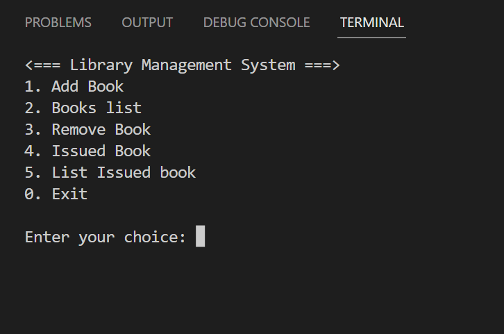

# Library_System
## To start this project
Run this command in your terminal\
`gcc library.c`\
`./a.exe`


# Library

This is the project build with `c` programming language. In this project user can choice the option to add, remove, Issue and see the list of book form library.



## Built With

- c programming language


## Getting Started

To get a local copy up and running follow these steps.

1. Clone the repo
   ```
   git@github.com:roshan-bajgain/Library_System.git
   ```

2. Go to project directory `cd Library_system`

3. Install project requirements `gcc compiler`

3. Start the project using `gcc library.c`
4. Run `./a.exe`


### Prerequisites

- code editor (eg: vscode)
- Git
- node.js

## Authors 1

👤 **Roshan Bajgain**

- GitHub: [@roshan-bajgain](https://github.com/roshan-bajgain)
- Twitter: [@RoshanBajgain10](https://twitter.com/RoshanBajgain10)
- LinkedIn: [LinkedIn](https://www.linkedin.com/in/roshan-bazgain/)

## Authors 2

👤 **Dinesh Bajgain**

- GitHub: [@roshan-bajgain](https://github.com/dinesh-bazgain)


## 🤝 Contributing

Contributions, issues, and feature requests are welcome!

## Show your support

Give a ⭐️ if you like this project!
